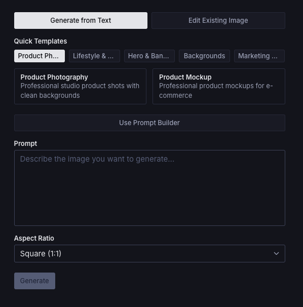
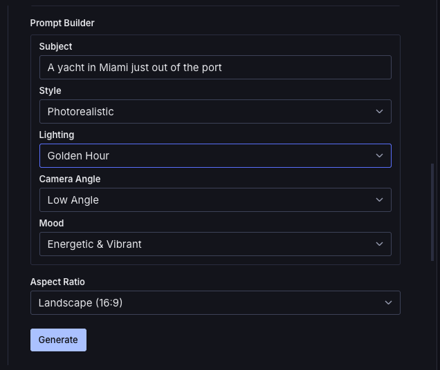
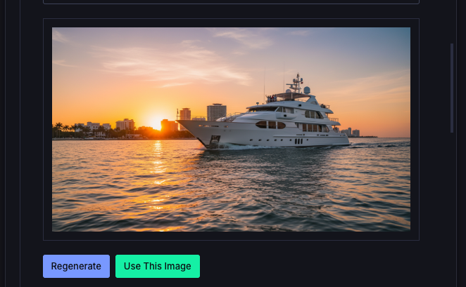

# Sanity Plugin: Gemini AI Image Generator

AI-powered image generation for Sanity Studio using Google's Gemini 2.5 Flash Image model.


[](https://www.npmjs.com/package/sanity-plugin-gemini-ai-images)


## Features

- **Text-to-Image Generation**: Create images from descriptive prompts
- **Image-to-Image Editing**: Upload photos and generate AI-powered variations
  - Change backgrounds (studio, outdoor, luxury, lifestyle)
  - Add lighting effects (dramatic, golden hour, reflections)
  - Remove clutter and enhance details
  - Create color variants and seasonal themes
- **Seamless Integration**: Appears directly in Sanity Studio's image picker alongside Upload, Unsplash, etc.
- **Prompt Templates**: Pre-built templates for both generation and editing
- **Prompt Builder**: Guided interface for constructing effective prompts
- **Multiple Aspect Ratios**: Support for 1:1, 16:9, 9:16, 4:3, 3:2, and more
- **Direct Sanity Upload**: Generated images automatically uploaded to Sanity assets
- **Secure Backend**: API key stays server-side only
- **Framework Adapters**: Ready-to-use adapters for Next.js and serverless platforms

## Screenshots


*AI Generator appears directly in the image picker alongside other sources*


*Generate images from text prompts with templates and aspect ratio options*


*Upload and edit existing images with AI-powered modifications*

## Quick Start (Next.js)

### 1. Install Packages

```bash
npm install sanity-plugin-gemini-ai-images sanity-plugin-gemini-ai-images-nextjs @google/genai
```

### 2. Add Plugin to Sanity Config

```typescript
// sanity.config.ts
import { defineConfig } from "sanity";
import { geminiAIImages } from "sanity-plugin-gemini-ai-images";

export default defineConfig({
  // ... other config
  plugins: [
    geminiAIImages(),
    // ... other plugins
  ],
});
```

### 3. Create API Route

```typescript
// app/api/gemini/generate-image/route.ts
import { POST } from "sanity-plugin-gemini-ai-images-nextjs/route";

export { POST };
```

### 4. Set Environment Variable

```bash
# .env.local
GEMINI_API_KEY=your_api_key_here
```

Get your API key from [Google AI Studio](https://aistudio.google.com/app/apikey).

**Important**: Do NOT use `NEXT_PUBLIC_` prefix - the API key must remain server-side only.

### 5. Done!

The "AI Generator" option will now appear in your Sanity Studio image picker.

## Adapters

This plugin uses an adapter pattern to work with different backend frameworks:

### Next.js Adapter

See [Quick Start](#quick-start-nextjs) above.

Full docs: [packages/adapter-nextjs/README.md](./packages/adapter-nextjs/README.md)

### Serverless Adapter

For Vercel Functions, Netlify Functions, AWS Lambda, etc.

```bash
npm install sanity-plugin-gemini-ai-images sanity-plugin-gemini-ai-images-serverless @google/genai
```

**Vercel:**

```typescript
// api/gemini/generate-image.ts
import { handler } from "sanity-plugin-gemini-ai-images-serverless";

export default handler;
```

**Netlify:**

```typescript
// netlify/functions/generate-image.ts
import { handler } from "sanity-plugin-gemini-ai-images-serverless";

export { handler };
```

Full docs: [packages/adapter-serverless/README.md](./packages/adapter-serverless/README.md)

## Usage

### In Sanity Studio

**Text-to-Image Generation:**

1. Navigate to any document with an image field
2. Click on an image field
3. Select "AI Generator" from the picker (alongside Upload, Unsplash, etc.)
4. Ensure "Generate from Text" mode is selected
5. Choose a template or write your own prompt
6. Select aspect ratio
7. Click "Generate"
8. Preview and click "Use This Image"

**Image-to-Image Editing:**

1. Click on an image field
2. Select "AI Generator" from the picker
3. Click "Edit Existing Image" mode
4. Upload a product photo or any image
5. Choose an edit template (change background, add effects, etc.) or write your own modifications
6. Click "Edit Image"
7. Preview the result and click "Use This Image"

**Example Use Cases:**

- Product photo with white background → Same product in luxury setting
- Indoor product shot → Same product in natural outdoor scene
- Plain product → Product with dramatic lighting and reflections
- Single angle → Multiple color variants
- Cluttered background → Clean, minimal background

### Prompt Templates

**Generation Templates:**

- **Product Photography**: Studio-lit product shots with clean backgrounds
- **Hero Banners**: Dramatic images for website headers
- **Minimalist Backgrounds**: Clean backgrounds with negative space
- **Lifestyle Photography**: Products in real-world context
- **Social Media Graphics**: Eye-catching posts
- **Product Mockups**: Professional e-commerce shots
- **Brand Storytelling**: Narrative-driven imagery

**Editing Templates:**

- **Backgrounds**: Change to studio, outdoor, luxury, or lifestyle settings
- **Lighting & Effects**: Add dramatic lighting, golden hour, reflections, water droplets
- **Cleanup & Enhance**: Remove backgrounds, clean up clutter, sharpen details
- **Creative Edits**: Add context items, seasonal themes, color variants, flat lay conversions

### Prompt Builder

The guided prompt builder helps you construct effective prompts by selecting:

- **Subject**: What you want to generate
- **Style**: Photorealistic, minimalist, artistic, illustration
- **Lighting**: Natural, studio, dramatic, golden hour
- **Camera Angle**: Eye-level, elevated, low-angle, aerial
- **Mood**: Neutral, warm, cool, energetic, serene

## Configuration

### Custom API Endpoint

```typescript
// sanity.config.ts
import { geminiAIImages } from "sanity-plugin-gemini-ai-images";

export default defineConfig({
  plugins: [
    geminiAIImages({
      apiEndpoint: "/api/custom/generate-image", // Custom endpoint
    }),
  ],
});
```

## Package Structure

This is a monorepo containing multiple packages:

- **`sanity-plugin-gemini-ai-images`** - Core plugin (Studio UI, components)
- **`sanity-plugin-gemini-ai-images-nextjs`** - Next.js adapter
- **`sanity-plugin-gemini-ai-images-serverless`** - Serverless adapter

## Requirements

- Node.js >= 20.0.0
- Sanity Studio v4
- Google Gemini API key

## Security Notes

- API key is stored server-side only (never exposed to client)
- All generation requests go through your backend API routes
- No direct client access to Gemini API

## Troubleshooting

### "Gemini API not configured" error

- Ensure `GEMINI_API_KEY` is set in your environment variables
- Restart your development server after adding the key
- Verify the key is correct at [Google AI Studio](https://aistudio.google.com/app/apikey)

### Images not saving

- Check Sanity write permissions
- Check browser console for error messages

### Slow generation

- Gemini image generation can take 10-30 seconds
- This is normal for AI image generation

## Contributing

Contributions are welcome! Please open an issue or PR on [GitHub](https://github.com/ncklrs/sanity-plugin-gemini-ai-images).

## License

MIT © Nick Jensen

## Credits

Built with:

- [Google Gemini AI](https://ai.google.dev/gemini-api/docs/image-generation)
- [Sanity Studio v4](https://www.sanity.io/)

## Links

- [GitHub Repository](https://github.com/ncklrs/sanity-plugin-gemini-ai-images)
- [npm Package](https://www.npmjs.com/package/sanity-plugin-gemini-ai-images)
- [Google Gemini API](https://ai.google.dev/gemini-api/docs/image-generation)
- [Sanity Plugin Directory](https://www.sanity.io/plugins)

# sanity-ai-image-video
